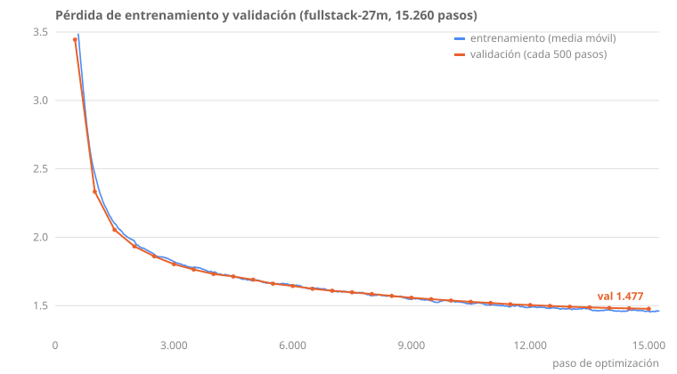

# fullstack-27m

Un modelo de lenguaje causal de **20,45 M de parámetros** (el nombre `27m` viene del diseño inicial de 26,75 M),
pre-entrenado **desde cero y enteramente en CPU**, especializado en autocompletado y generación de código Full Stack:
React, Next.js y TypeScript en el frontend; Node (Express, NestJS) y Python (FastAPI, Flask) en el backend.

No hay GPU en ninguna parte de este proyecto. Todo el pipeline —datos, tokenizer, arquitectura, entrenamiento e
inferencia— está diseñado alrededor de las restricciones de un portátil: un Intel i5-1135G7 de 4 núcleos y 16 GB de RAM.

> **Estado:** pipeline completo y modelo entrenado (15.260 pasos, pérdida de validación 1,477). Los resultados medidos
> y las limitaciones están en la sección [Resultados](#resultados).

---

## Por qué 27M y no 50M

El objetivo inicial era un modelo de 50M de parámetros. Medir el hardware antes de escribir el modelo cambió la decisión.

Un modelo de 50M parámetros necesita ~1.000M de tokens para acercarse al óptimo de Chinchilla. A los 303 tokens/s que
esta CPU sostiene con esa arquitectura, son **~45 días** de entrenamiento continuo. Con 27M parámetros el throughput
sube a 1.057 tokens/s y el presupuesto de 8 días permite 500M de tokens: **19 tokens por parámetro**, prácticamente el
óptimo (534M).

Mismo tiempo de cómputo. Un modelo considerablemente mejor.

| Configuración | Parámetros | tok/s | Tokens en 8 días | Tokens/parámetro |
|---|---|---|---|---|
| d=512, L=10 | 48.3 M | 303 | 150 M | 3.1 (infraentrenado) |
| **d=384, L=8** | **26.7 M** | **1057** | **500 M** | **19 (casi óptimo)** |

## La precisión mixta no siempre acelera

El plan original contemplaba bf16. La medición lo descartó:

```
GEMM 1024x1024, 4 hilos
  float32     213.8 GFLOPS
  bfloat16     59.1 GFLOPS     <-- 3.6x mas lento
```

El i5-1135G7 (Tiger Lake) tiene AVX-512 pero **no** AVX512-BF16 ni AMX. Sin instrucciones nativas, bf16 se emula en
software y cada operación cuesta más que en fp32. El entrenamiento usa fp32 puro.

## El SMT perjudica al entrenamiento

Los 8 hilos lógicos de la CPU no son 8 unidades de cómputo. Los dos hilos de cada núcleo comparten una sola unidad
vectorial:

```
 1 hilos   105.7 GFLOPS
 2 hilos   214.4 GFLOPS
 4 hilos   349.8 GFLOPS     <-- mejor (= nucleos fisicos)
 8 hilos   228.2 GFLOPS     <-- 35% peor que 4
```

`num_threads = 4`, verificado por medición.

---

## Arquitectura

Estilo Llama en lugar de GPT-2: a igualdad de parámetros converge mejor, con coste de cómputo equivalente.

```
d_model      384          n_layers   8        n_heads   6  (head_dim 64)
contexto     512          vocab      16.384   FFN       1024 (SwiGLU)
Norm         RMSNorm      Posicion   RoPE     Bias      ninguno
Embeddings   tied (entrada y salida comparten pesos)

Parametros   20.45 M  (14.2 M sin contar embeddings)
```

Un detalle que condiciona el diseño: con `d_model=384` y un vocabulario de 32.768, la proyección final consume **~46% del
cómputo por token**. El tamaño del vocabulario no es una decisión cosmética, y se tomó midiendo compresión real contra
velocidad (Fase 2): el vocabulario de **16.384** comprime el 96,7 % de lo que comprime el de 32.768 (umbral: 81 %) y el
modelo corre más rápido, así que ganó. Consecuencia: el modelo pasa de 26.75 M a **20.45 M parámetros**.

## Presupuesto de entrenamiento

| Métrica | Valor |
|---|---|
| Tokens | 500 M |
| Pasos de optimizador | 15.260 |
| Batch efectivo | 32.768 tokens (micro-batch 16 × acumulación 4) |
| Throughput sostenido | 1.103 tok/s medios (≈ 95 M tokens/día de cómputo puro) |
| Duración real | ≈ 5,25 días de cómputo, ≈ 9 días de calendario en sesiones reanudables |

---

## Resultados

### Entrenamiento



| Métrica | Valor |
|---|---|
| Pérdida de validación | 3,44 (paso 500) → **1,477** (paso 15.000, la mejor) |
| Pérdida de entrenamiento final | ~1,50: prácticamente igual a la de validación, sin sobreajuste visible |
| Velocidad | 1.103 tok/s medios; hubo caídas puntuales (hasta 369 tok/s) sin causa registrada |
| Datos de la curva | `avance/fase-06-curva-validacion.csv` |

### Validez sintáctica del código generado

El modelo escribe 100 archivos desde cero (solo se le da `<|file|><|lang_x|>`; 34 JS, 33 TS, 33 Python; hasta 256
tokens; T=0,8, top-k 40, top-p 0,95; semillas fijas). Se comprueba si cada uno **parsea**: `ast.parse` para Python y el
parser de TypeScript 5.x para JS/JSX/TS/TSX. Es una métrica de *sintaxis*: no dice si el código funciona, ni siquiera si
sus variables existen.

| Criterio | Modelo | Archivos reales de validación (*) |
|---|---|---|
| **Estricta:** el fragmento completo parsea | **23 %** | 97 % |
| **Recortada:** parsea tras quitar las últimas líneas (cortadas por el límite de tokens), conservando ≥ 80 % | **71 %** | 97 % |
| Terminados por el propio modelo (`<\|endoftext\|>`) | 14 de 100 | 100 de 100 |
| …de esos, los que parsean | 12 de 14 (86 %) | 97 % |
| Líneas repetidas dentro del fragmento (media) | 14 % | 2 % |
| Fragmentos con ≥ 30 % de líneas repetidas | 16 % | 0 % |

(*) 100 archivos completos de validación de ≤ 256 tokens, medidos con el mismo validador: sirven para comprobar que el
validador no rechaza código bueno (los 3 que fallan son una plantilla de scaffolding con `<%= %>`, un `print` de Python 2 y un archivo con un error de tipeo).

Cómo leerlo: la cifra estricta es baja sobre todo porque **86 de 100 fragmentos no terminaron**: el modelo rara vez cierra
un archivo en 256 tokens y se corta a mitad de una sentencia. Al recortar esa cola, el 71 % queda bien formado hasta donde
llega. Por lenguaje (estricta / recortada): JS 24 % / 62 %, TS 27 % / 73 %, Python 18 % / 79 %. Con solo 14 fragmentos
terminados, la cifra del 86 % tiene mucho margen de error.

### Suite de 20 prompts del dominio

Prompts como `export default async function BlogPage() {` (Next.js), `@Controller('cats')` (NestJS) o
`@app.post('/items')` (FastAPI). Resultado sin selección, una sola generación por prompt (T=0,7, 200 tokens):

| Criterio | Resultado |
|---|---|
| Sintaxis estricta (prompt + continuación parsea) | 12 / 20 (60 %) |
| Sintaxis recortada | 15 / 20 (75 %) |
| «En tema» (la continuación menciona algo esperado, p. ej. `NextResponse`, `jsonify`) | 12 / 20 (60 %) |

Cada continuación completa está en [`samples/suite-20-prompts.md`](samples/suite-20-prompts.md). Con n = 20, cada prompt
pesa 5 puntos porcentuales: es una muestra, no una estimación precisa. «En tema» es una heurística de texto, no una
medida de corrección.

### Velocidad de inferencia

La caché KV acelera la generación unas **9×**: 90 tok/s con caché contra 10 tok/s sin ella (100 tokens nuevos sobre un
prompt de 200, 4 hilos). La salida es la misma: hay un test que compara, token a token, la generación con y sin caché.

### Decodificación recomendada (Fase 8)

Un diagnóstico sin reentrenar mostró que buena parte de los defectos de superficie eran de decodificación. Con una penalización de
repetición de 1,1 sobre los últimos 64 tokens generados (la demo y `src/sample.py` la usan por defecto; con `--rep-penalty 1.0` se
recupera el comportamiento original):

| 100 fragmentos desde cero | Antes | Con `rep=1,1` |
|---|---|---|
| Sintaxis estricta, 256 / 512 tokens | 23 % / 33 % | **46 % / 63 %** |
| Fragmentos con ≥ 30 % de líneas repetidas, 256 / 512 | 16 % / 52 % | **1 % / 7 %** |
| Terminados por el modelo, 256 / 512 | 14 / 26 | **36 / 63** |
| Sintaxis recortada, 256 / 512 | 71 % / 73 % | 68 % / 77 % (sin mejora clara) |
| pass@1 en 30 tareas funcionales | 1,3 % | 1,3 % (sin cambio) |

Reserva importante: arregla los bucles y el cierre de archivos, **no la capacidad del modelo** (no resuelve tareas simples de
código y, con la penalización, el Python parseable tiene más nombres sin definir). El plan para mejorarlo de verdad está en
[`docs/plan-mejoras-modelo.md`](docs/plan-mejoras-modelo.md); el detalle, en `avance/fase-08-diagnostico-decodificacion.md`.

### Qué hace bien y qué no

- **Bien:** estructura reconocible de React, Express, NestJS y FastAPI; imports plausibles; JSX bien formado; respeta la
  sangría y la sintaxis a corto alcance.
- **Mal:** **repite** (copia líneas y bloques, ver la tabla); se pierde a larga distancia (contexto de 512 tokens); rara
  vez cierra los archivos; se desvía de framework (un prompt de FastAPI derivó a Flask); inventa APIs y nombres. Es lo
  esperable de 20,45 M de parámetros, y el proyecto no pretende más.
- **Corpus:** Next.js (0,1 %) y FastAPI (<0,1 %) están casi ausentes de los datos (ver `avance/fase-01-dataset.md`).

La demo interactiva está transcrita en [`samples/demo-cli.md`](samples/demo-cli.md).

---

## Estructura

```
config/model_27m.json    Fuente de verdad: arquitectura, entrenamiento, datos, rutas
src/config.py            Carga y valida el config; conteo analitico de parametros
src/bench.py             Banco de pruebas: GFLOPS, escalado por hilos, tok/s
src/data/                Ingesta en streaming, filtrado de dominio, deduplicacion
src/tokenizer/           BPE byte-level entrenado sobre el corpus propio
src/model/               RMSNorm, RoPE, SwiGLU, GPT (con cache KV para inferencia)
src/train.py             Bucle de entrenamiento con acumulacion y reanudacion exacta
src/sample.py            Generacion: temperatura, top-k, top-p, cache KV
src/cli.py               Demo interactiva de autocompletado (demo.bat)
src/eval/                Validez sintactica, suite de 20 prompts, curvas de entrenamiento
tests/                   Causalidad, parametros, tokenizer, entrenamiento, cache KV, validador sintactico
benchmarks/              baseline.json, syntax_eval.json, prompt_suite.json (resultados reproducibles)
samples/                 Salidas del modelo: suite de 20 prompts y transcripcion de la demo
avance/                  Bitacora fase por fase, con desviaciones y cifras
```

Los datos y los checkpoints viven en `C:/llm-fullstack-data/`, **fuera de OneDrive**: un checkpoint de ~245 MB reescrito
cada pocos minutos durante días es una invitación a que el cliente de sincronización bloquee un archivo a mitad de
escritura. Los pesos (`best.pt`) no se versionan.

## Uso

```bash
python src/bench.py                                   # linea base de rendimiento
pytest tests/ -v                                      # suite de tests (219)
python src/train.py --resume                          # entrenar / reanudar (o entrenar.bat)
python src/sample.py --prompt "export default function Nav(" --lang tsx --seed 1
python src/eval/syntax_check.py --n 100               # metrica de validez sintactica
python src/eval/run_suite.py                          # suite de 20 prompts
python src/cli.py                                     # demo interactiva (o demo.bat)
```

**Validador de JS/TS (una sola vez).** El parser de TypeScript se instala fuera del repo:

```bash
mkdir C:/llm-fullstack-data/tools && cd C:/llm-fullstack-data/tools
npm init -y && npm install typescript@5
```

(La rama 7.x no expone la API de JavaScript que se usa.) Python se valida con `ast` y no necesita nada más.

## Requisitos

Python 3.14, PyTorch 2.14 CPU, Node.js (solo para validar JS/TS). Ver `requirements.txt`.

---

## Qué es y qué no es este proyecto

Un modelo de 20,45 M de parámetros entrenado con 500 M de tokens genera código de **estructura reconocible** (imports
plausibles, JSX bien formado, decoradores de FastAPI en su sitio), pero **solo el 23 % de sus archivos completos parsea
tal cual** (71 % si se descarta la cola cortada), repite bloques y se pierde a larga distancia. No genera código listo
para producción, y no compite con asistentes comerciales entrenados con órdenes de magnitud más de cómputo.

El objeto de este repositorio es el pipeline de ingeniería y las decisiones medidas que lo sostienen.
